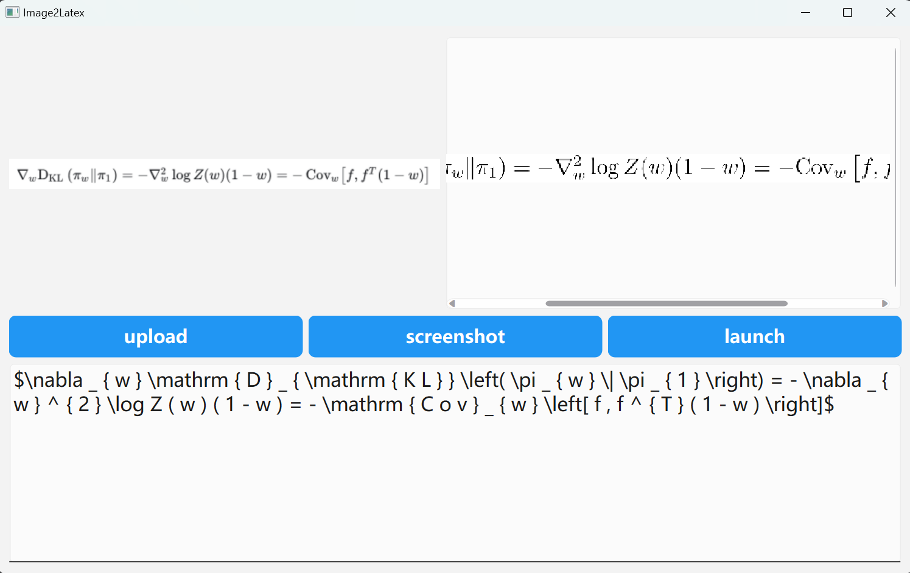

# LocalTex



一个~~简陋~~轻量的基于pyqt6的latex识别框架，后端目前调用的是HF大模型。

如何使用：

**upload**/**screenshot** -> **launch**

**注意：第一次launch需要一定时间从HF下载并加载模型，加载本身需要一定时间。**

## Quick start

建议提前安装torch的cuda版本。

linux系统（含wsl）可以安装flash-attn以支持flash-attention-2.

```shell
git clone ...
cd ...

conda create -n localtex python=3.9 # 强烈建议新建环境
pip install -r requirement
```

```shell
python main.py
```

## Some result

该测试结果基于 [LaTeX_OCR](https://huggingface.co/datasets/linxy/LaTeX_OCR) full版本测试集，大小约为10K

| model                                         | metric            | value |
|-----------------------------------------------|-------------------|-------|
| prithivMLmods/Qwen2-VL-OCR-2B-Instruct (bf16) | rouge-l: f1-score | 0.88  |
|                                               | CER               | 0.24  |
|                                               |                   |       |

经测试，`prithivMLmods/Qwen2-VL-OCR-2B-Instruct (bf16)`无法识别demo中的hard.png。
量化后的版本似乎结果下降的比较严重，

## TODO

- [ ] 测试更多模型
- [ ] 优化latex渲染

## Other

pyqt6用得不是很熟练，实现方式可能令人捉急，请多谅解。

本项目的动机是想看看有没有可能微调一下开源视觉llm就可以达到令人满意的效果，然后又没找到比较方便的框架，就自己简单搓了一个。

## Reference

渲染latex的时候用到的图片裁剪小工具：

https://www.cnblogs.com/shiwanghualuo/p/17794765.html

我的pyqt6教练们：

[kimi](https://kimi.moonshot.cn/)
[chatgpt](https://chat.openai.com/)
[deepseek](https://chat.deepseek.com/)

models:

[prithivMLmods/Qwen2-VL-OCR-2B-Instruct](https://huggingface.co/prithivMLmods/Qwen2-VL-OCR-2B-Instruct/tree/main)
